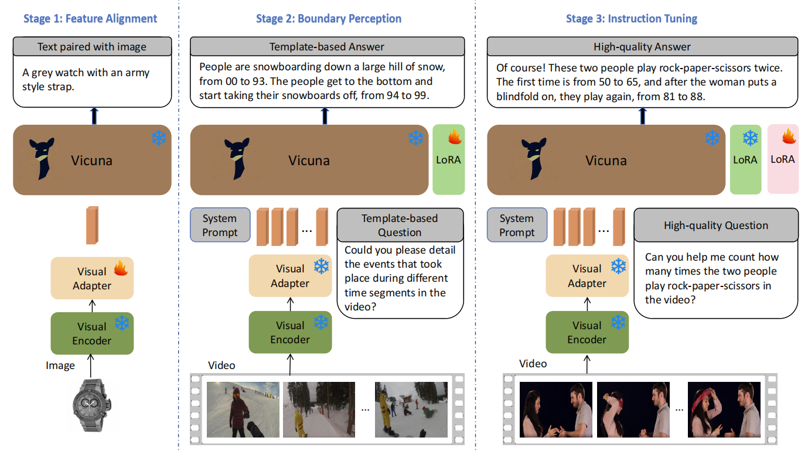
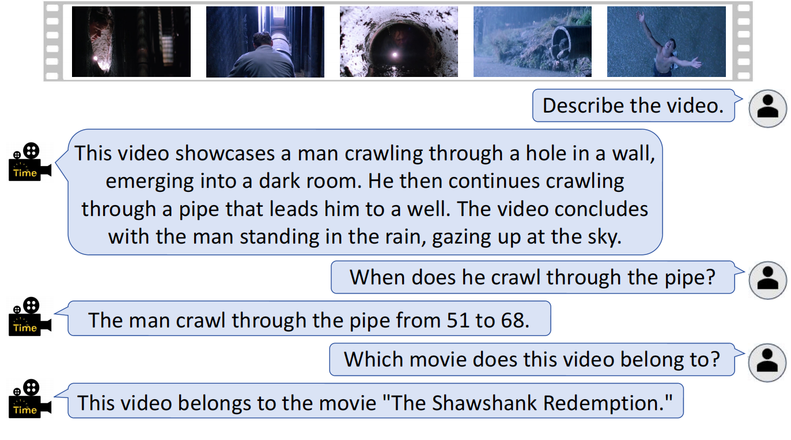
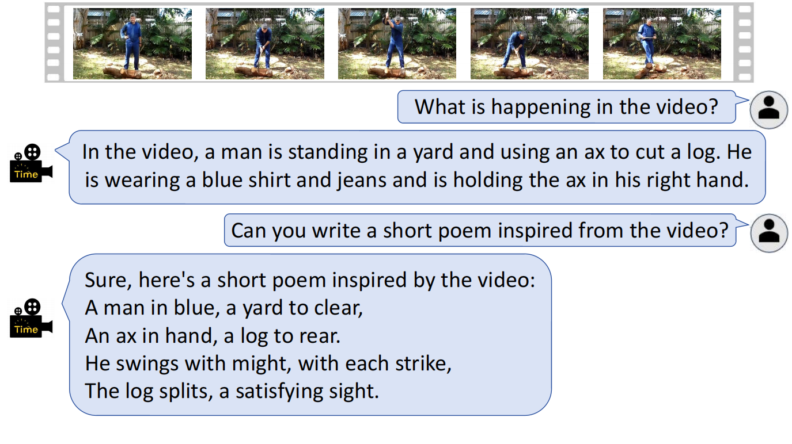
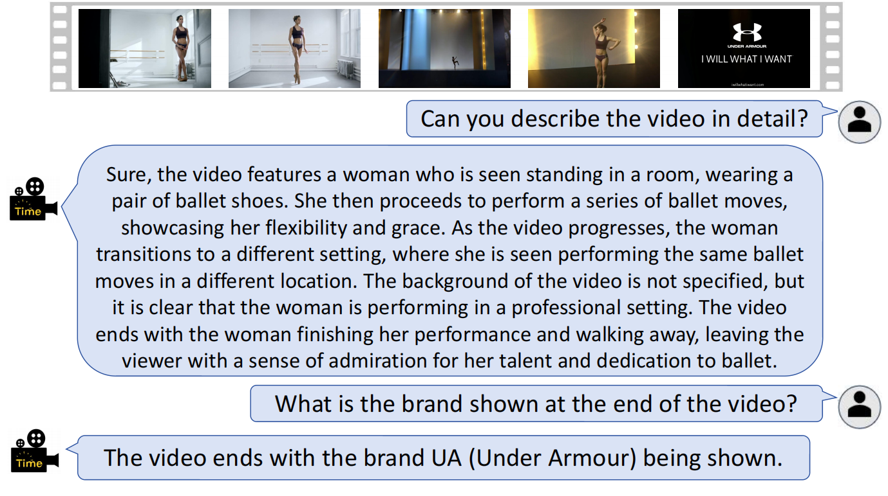
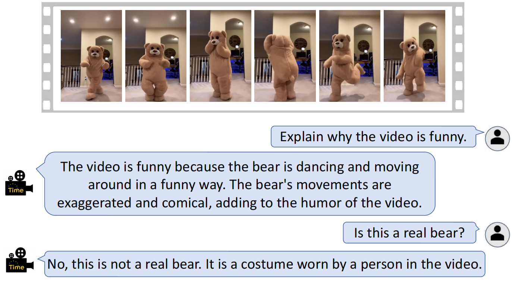

# VTimeLLM \[[Paper](https://arxiv.org/pdf/2311.18445.pdf)\]
Official PyTorch implementation of the paper "VTimeLLM: Empower LLM to Grasp Video Moments".


[](https://paperswithcode.com/sota/video-based-generative-performance-4?p=vtimellm-empower-llm-to-grasp-video-moments)
 	
[](https://paperswithcode.com/sota/dense-video-captioning-on-activitynet?p=vtimellm-empower-llm-to-grasp-video-moments)
 	
[](https://paperswithcode.com/sota/video-based-generative-performance-3?p=vtimellm-empower-llm-to-grasp-video-moments)
 	
[](https://paperswithcode.com/sota/video-based-generative-performance-1?p=vtimellm-empower-llm-to-grasp-video-moments)


[](https://paperswithcode.com/sota/video-based-generative-performance-5?p=vtimellm-empower-llm-to-grasp-video-moments)

[](https://paperswithcode.com/sota/video-based-generative-performance-2?p=vtimellm-empower-llm-to-grasp-video-moments)
 	
[](https://paperswithcode.com/sota/video-based-generative-performance?p=vtimellm-empower-llm-to-grasp-video-moments)

---

## :loudspeaker: Latest Updates
- **Jan-2**: Thanks to [Xiao Xia](https://github.com/Rishubi) , [Shengbo Tong](https://github.com/tsb-19) and [Beining Wang](https://github.com/Benson0704), we have refactored the code to now support both the LLAMA and ChatGLM3 architectures. We translated the training data into Chinese and fine-tuned a Chinese version based on the ChatGLM3-6b. 
- **Dec-14**: Released the training code and data. All the resources including models, datasets and extracted features are available 
[here](https://cloud.tsinghua.edu.cn/d/6db5d02883124826aa6f/?p=%2F&mode=list). :fire::fire:
- **Dec-4**: VTimeLLM: demo released.

---


## VTimeLLM Overview :bulb:

VTimeLLM is a novel Video LLM designed for fine-grained video moment understanding and reasoning with respect to time boundary.

VTimeLLM adopts a boundary-aware three-stage training strategy, which respectively utilizes image-text pairs for feature alignment, multiple-event videos to increase temporal-boundary awareness, and high-quality video-instruction tuning to further improve temporal understanding ability as well as align with human intents.




---

## Contributions :trophy:

- We propose VTimeLLM, the first boundary-aware Video LLM, to the best of our knowledge.
- We propose the boundary-aware three-stage training strategy, which consecutively leverages i) large-scale image-text data for feature alignment, ii) large-scale multi-event video-text data together with the temporal-related single-turn and multi-turn QA to enhance the awareness of time boundary, and iii) instruction tuning on the high-quality dialog dataset for better temporal reasoning ability.
- We conduct extensive experiments to demonstrate that the proposed VTimeLLM significantly outperforms existing Video LLMs in various fine-grained temporal-related video tasks, showing its superior ability for video understanding and reasoning.


---

## Installation :wrench:

We recommend setting up a conda environment for the project:
```shell
conda create --name=vtimellm python=3.10
conda activate vtimellm

git clone https://github.com/huangb23/VTimeLLM.git
cd VTimeLLM
pip install -r requirements.txt
```
Additionally, install additional packages for training cases.
```shell
pip install ninja
pip install flash-attn --no-build-isolation
```


## Running Demo Offline :cd:

To run the demo offline, please refer to the instructions in [offline_demo.md](docs/offline_demo.md).

## Training :train:

For training instructions, check out [train.md](docs/train.md).

## Qualitative Analysis :mag:

A Comprehensive Evaluation of VTimeLLM's Performance across Multiple Tasks.


### Video Understanding and Conversational Tasks :speech_balloon:
 

---

### Creative Tasks :paintbrush:
 

---
### Fine-grained Understanding Tasks :globe_with_meridians:
 

---
### Video Reasoning Tasks :question:
 

---


## Acknowledgements :pray:

We are grateful for the following awesome projects our VTimeLLM arising from:

* [LLaVA](https://github.com/haotian-liu/LLaVA): Large Language and Vision Assistant
* [FastChat](https://github.com/lm-sys/FastChat): An Open Platform for Training, Serving, and Evaluating Large Language Model based Chatbots
* [Video-ChatGPT](https://github.com/mbzuai-oryx/Video-ChatGPT): Towards Detailed Video Understanding via Large Vision and Language Models
* [LLaMA](https://github.com/facebookresearch/llama): Open and Efficient Foundation Language Models
* [Vid2seq](https://github.com/google-research/scenic/tree/main/scenic/projects/vid2seq): Large-Scale Pretraining of a Visual Language Model for Dense Video Captioning
* [InternVid](https://github.com/OpenGVLab/InternVideo/tree/main/Data/InternVid): A Large-scale Video-Text dataset


If you're using VTimeLLM in your research or applications, please cite using this BibTeX:
```bibtex
@article{huang2023vtimellm,
  title={VTimeLLM: Empower LLM to Grasp Video Moments},
  author={Huang, Bin and Wang, Xin and Chen, Hong and Song, Zihan and Zhu, Wenwu},
  journal={arXiv preprint arXiv:2311.18445},
  year={2023}
}
```

## License :scroll:
<a rel="license" href="https://creativecommons.org/licenses/by-nc-nd/4.0/"></a> 

This work is licensed under a <a rel="license" href="http://creativecommons.org/licenses/by-nc-nd/4.0/">Creative Commons Attribution-NonCommercial-NoDerivs 4.0 International License</a>.


Looking forward to your feedback, contributions, and stars! :star2:
